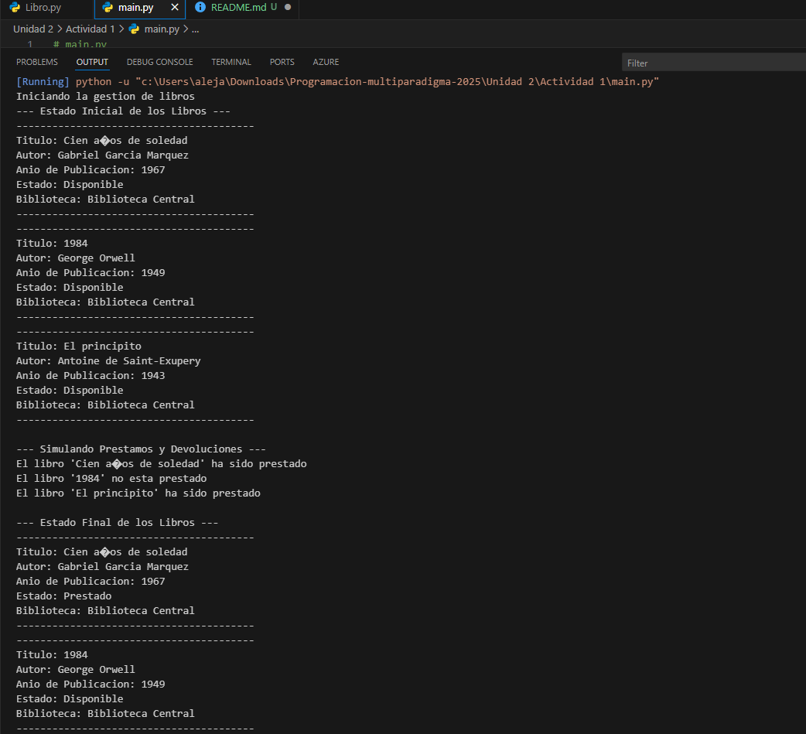
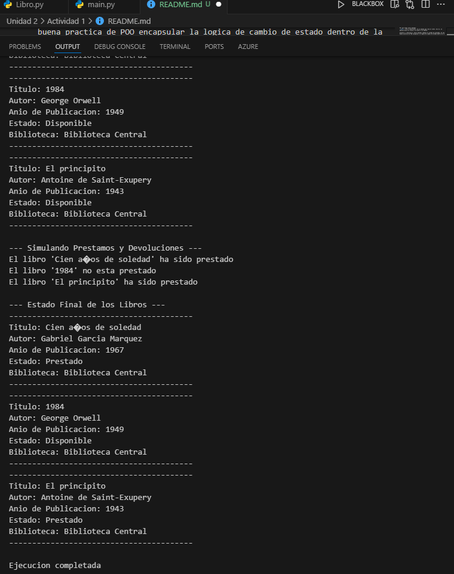

Por que elegi estos atributos
titulo autor anio_publicacion: Son los datos basicos que identifican un libro, Son atributos de instancia porque cada libro tiene un titulo, un autor y un año unicos. No tiene sentido que un libro comparta esta informacion con otro.

prestado: Este es un booleano (True o False), Es la forma mas sencilla de saber si el libro esta en la biblioteca o no. Se inicializa en False porque cuando creas un libro, asumes que esta disponible.

biblioteca: Este es un atributo de clase, La "Biblioteca Central" es la misma para todos los libros del sistema. Ponerlo como atributo de clase evita repetir la informacion en cada objeto y demuestra que es un valor compartido.

Por que elegi estos metodos
__init__: Es el constructor, Es el metodo que crea el libro. Sin el, no podrias darle un titulo o un autor a tu objeto.

prestar() y devolver(): Estos metodos cambian el estado de prestado, Es una buena practica de POO encapsular la logica de cambio de estado dentro de la clase. Asi, en lugar de cambiar directamente libro1.prestado = True, usas libro1.prestar(), lo cual es mas claro y seguro.

mostrar_estado(): Este metodo es solo para imprimir, Reune toda la informacion del libro y la muestra de una forma facil de leer. Es util para ver rapidamente si el diseño funciona como esperas.

EJECUCION DEL CODIGO:

