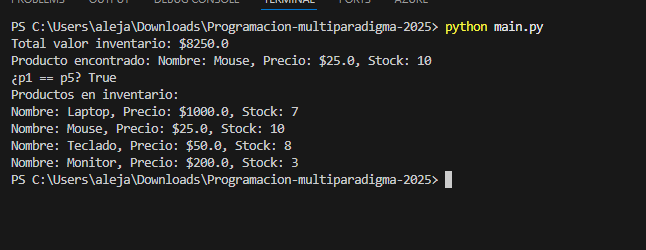

cx# Implementación de Encapsulación en Inventario de Productos

## Descripción
Este proyecto implementa un sistema de inventario de productos utilizando principios de encapsulación en Python. Se crean dos clases principales: `Producto` e `Inventario`, con atributos privados y protegidos, getters y setters para validación, y métodos especiales para comparación y representación.

## Diseño y Abstracción Aplicada

### Clase Producto
- **Atributos**:
  - `nombre`: Público (str) - Nombre del producto.
  - `_precio`: Protegido (float) - Precio del producto, accesible pero no recomendado modificar directamente.
  - `__stock`: Privado (int) - Cantidad en stock, solo accesible mediante getter/setter.

- **Métodos**:
  - `__init__(self, nombre, precio)`: Inicializa el producto y valida que el precio sea mayor a 0.
  - `@property stock` y `@stock.setter`: Getter y setter para stock con validación de no negativo.
  - `@property precio` y `@precio.setter`: Getter y setter para precio con validación de mayor a 0.
  - `__str__`: Retorna una representación legible del producto.
  - `__eq__(self, other)`: Compara productos por nombre.

### Clase Inventario
- **Atributos**:
  - `__productos`: Privado (dict) - Diccionario con nombres como claves y objetos Producto como valores.

- **Métodos**:
  - `__init__(self)`: Inicializa el diccionario vacío.
  - `agregar_producto(self, producto)`: Agrega un producto o actualiza si ya existe (usando setter de stock).
  - `buscar_producto(self, nombre)`: Busca y retorna el producto por nombre o None.
  - `total_valor_inventario(self)`: Calcula el valor total (precio * stock) de todos los productos.
  - `__len__(self)`: Retorna el número de productos.
  - `__str__`: Lista todos los productos en formato legible.

### Por qué Encapsulación
- **Atributos Privados/Protector**: Protegen el estado interno de las clases, evitando modificaciones accidentales o inválidas. Los getters/setters permiten control sobre cómo se accede y modifica la data, aplicando validaciones (e.g., precio > 0, stock >= 0).
- **Abstracción**: Las clases ocultan detalles de implementación (e.g., cómo se almacena el inventario), exponiendo solo interfaces necesarias (métodos públicos). Esto facilita el uso y mantenimiento del código.
- **Métodos Especiales**: `__str__` y `__eq__` permiten usar objetos como strings y compararlos naturalmente, mejorando la usabilidad.

## Ejecución
Ejecuta `python main.py` para ver una demostración:
- Creación de inventario.
- Agregado de productos.
- Modificación de stock y precios.
- Cálculo de valor total.
- Búsqueda de producto.
- Comparación de productos.
- Listado del inventario.

### Salida de Ejemplo
```
Total valor inventario: $8250.0
Producto encontrado: Nombre: Mouse, Precio: $25.0, Stock: 10
¿p1 == p5? True
Productos en inventario:
Nombre: Laptop, Precio: $1000.0, Stock: 7
Nombre: Mouse, Precio: $25.0, Stock: 10
Nombre: Teclado, Precio: $50.0, Stock: 8
Nombre: Monitor, Precio: $200.0, Stock: 3
```

## Archivos
- `producto.py`: Clase Producto.
- `inventario.py`: Clase Inventario.
- `main.py`: Script principal de demostración.
- `README.md`: Este archivo.


## ejecucion


